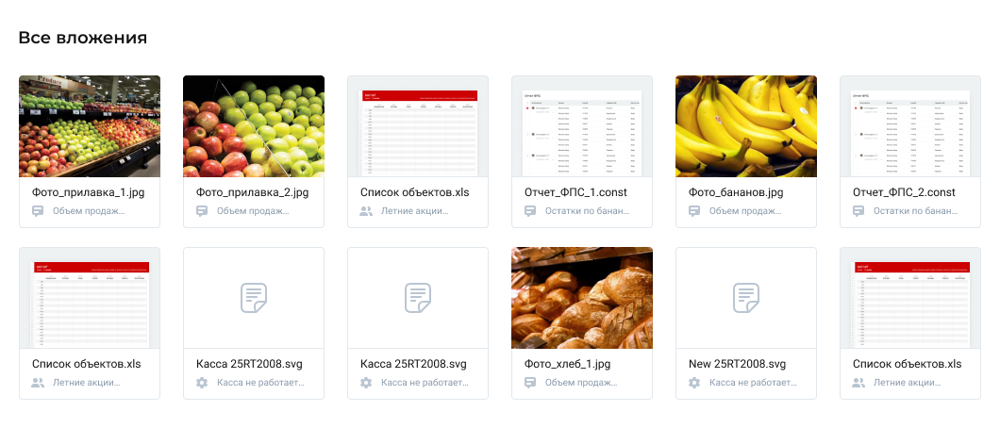

# First

## Задача

Реализовать приложение «Все вложения».

Основная цель приложения — отобразить карточки приложения.

Необходимо:
* имитировать запрос на backend для получения списка вложений при помощи одного из оператора создания (creation operators) rxjs (работа с mock данными)
* при клике на карточку происходит `alert()` с произвольным сообщением

Будет плюсом:
* вёрстка реагирует на изменение ширины браузера (responsive/adaptive по желанию)

### Макет

Исходник в [figma](https://www.figma.com/file/YmNwDoqcbCzTv7btK4R1Oe/all_attachments)*

*если не разобрались как экспортировать из figma допускается замена изображений и иконок на другие, главное сохранить размеры

## Результат

* разработана архитектура приложения (созданы необходимые компоненты, сервисы и пр.)
* после загрузки приложения происходит имитация запроса для получения списка вложений и его рендеринга
* при клике на вложение появляется `alert()`
