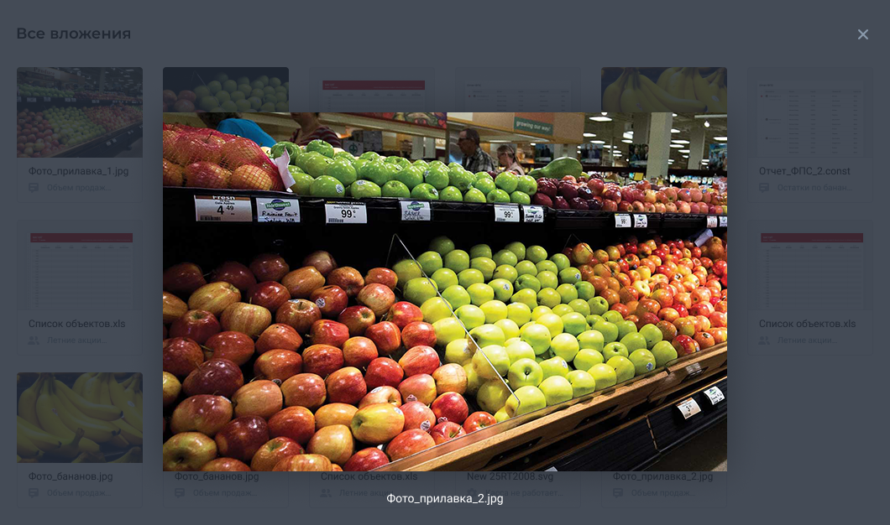

# Second

## Задача

На основе приложения «Все вложения», реализованного при решение задачи первого уровня произвести доработки, а именно:

* используя angular cdk, реализовать модальное окно (МО) с детальным просмотром вложения в МО передаётся информация о вложение:
  * путь до полного изображения (если есть)
  * наименование вложения
* при клике на крестик МО закрывается
* переписать стили с css на scss и/или применить bem нотификацию (если ранее не было сделано)

### Макет

Исходник в [figma](https://www.figma.com/file/YmNwDoqcbCzTv7btK4R1Oe/all_attachments?node-id=20%3A286)*

*если не разобрались как экспортировать из figma допускается замена изображений и иконок на другие, главное сохранить размеры

## Результат

* при клике на вложение открывается МО с детальным изображением и названием, при нажатие на крестик МО закрывается
* для написания стилей используется scss и/или соблюдается bem нотификация при именовании правил
